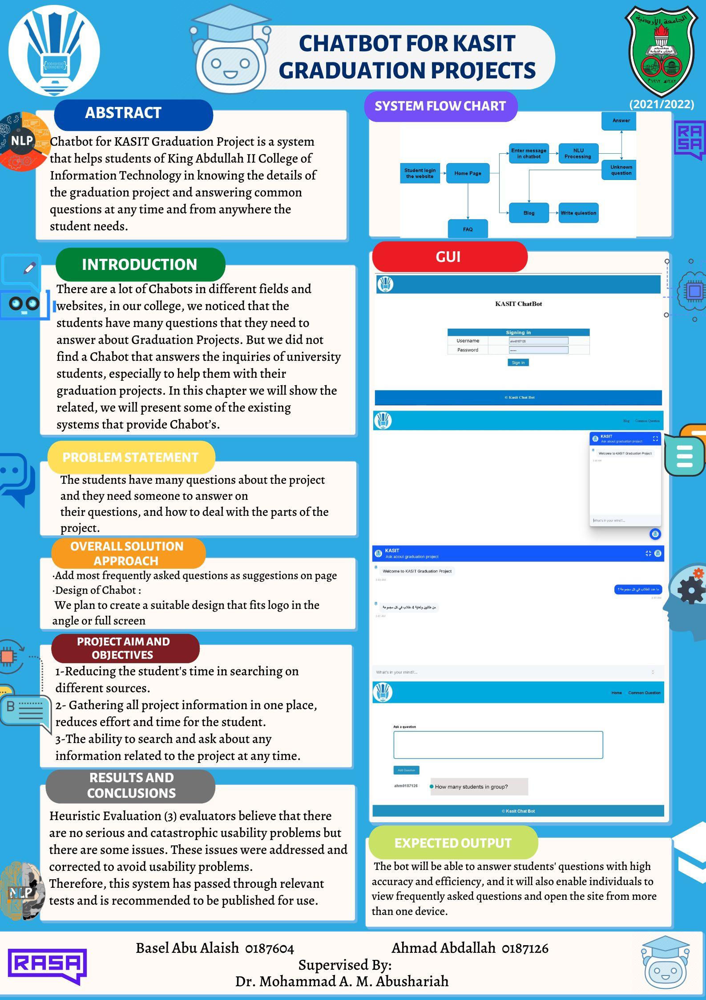

# KASIT Graduation Project

### -  Chabot for KASIT Graduation Project is a system that helps students of King Abdullah II College of Information Technology in knowing the details of the graduation project and answering common questions at any time and from anywhere the student needs.

### - Using Rasa framework that support NLP And NLU and also  Spring boot freamwork .

- Documentation is with the files (KASIT Graduation Project)

